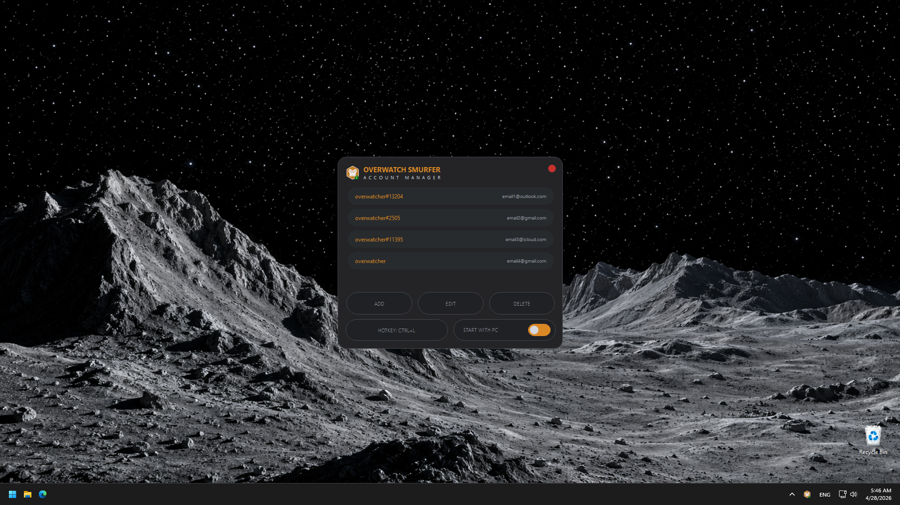
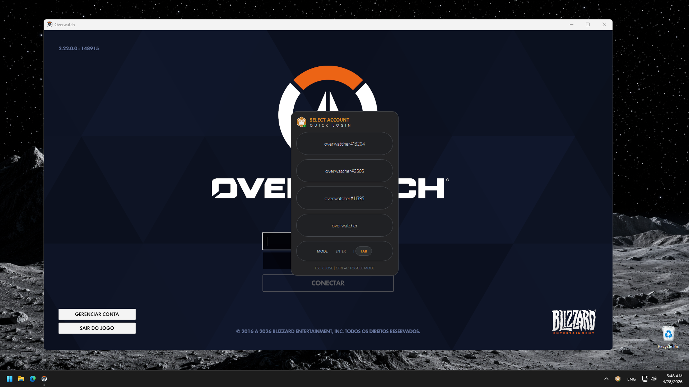

# OW Smurfer

A small Windows helper for quickly logging into saved Overwatch accounts.

<p>
  
  
</p>

## Features

- Pill-style desktop UI
- System tray menu with Settings and Exit
- Quick account selector
- Configurable login hotkey
- Enter or Tab mode between email and password fields
- Optional startup with Windows
- Portable credential obfuscation in the local config file

## Requirements

- Windows
- Python 3
- Dependencies from `requirements.txt`

## Install

```powershell
pip install -r requirements.txt
```

## Run

```powershell
pythonw OW_Smurfer.pyw
```

Use the tray icon to open settings, add accounts, change the hotkey, and enable startup with Windows.

## Notes

- The app is contained in `OW_Smurfer.pyw`.
- Account credentials are stored in `%LOCALAPPDATA%\OW_Smurfer\config.json`.
- Credentials are obfuscated to avoid plain-text reading, but this is not strong encryption.
- `Overwatch.lnk` forces windowed mode with borders before starting Overwatch.
